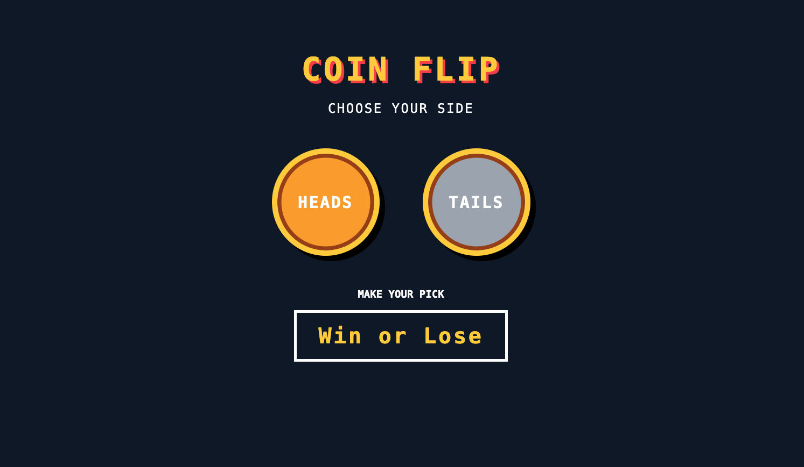

# 🪙 Coin Flip

Coin Flip is a simple full-stack application that simulates flipping a coin. The user interacts with the front end, which sends a request to the server to generate the result and return it to the page.

I built this project to practice connecting client-side JavaScript to a server and better understand how the front end and back end communicate with each other.

## 📸 Project Preview

## ✨ Features

- Flip a virtual coin
- Randomly return heads or tails
- Send requests from the front end to the server
- Receive and display server responses on the page
- Simple retro video game-inspired interface

## 🛠️ Built With

- HTML5
- CSS3
- JavaScript
- Node.js

## 🧠 What I Learned

This project helped me strengthen my understanding of:

- Running JavaScript on a server with Node.js
- Sending requests from the front end to the server
- Handling requests on the server
- Sending data back to the client
- Working with server responses in the browser
- Updating the DOM based on returned data
- Separating front-end and back-end responsibilities
- Generating random outcomes with JavaScript

## 🔄 How It Works

When the user flips the coin, the front end sends a request to the server.

The server handles the request, randomly determines whether the result is heads or tails, and sends that result back to the client.

The front end then uses the server's response to display the result to the user.

## 💻 Client-Server Communication

One of the main goals of this project was learning how the browser and server work together.

Instead of handling all of the application's logic directly in the browser, the coin flip result is handled by the server. This gave me hands-on practice with the request-response cycle and helped me better understand the separation between client-side and server-side JavaScript.